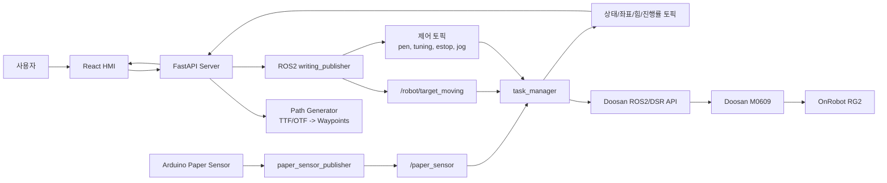
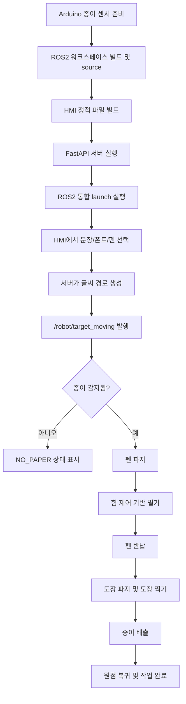

# Cobot Writing System

두산 M0609 협동로봇, OnRobot RG2 그리퍼, Arduino 종이 감지 센서, FastAPI 서버, React HMI를 연동한 자동 필기 시스템입니다. 사용자가 HMI에서 문장과 글꼴을 입력하면 서버가 폰트 경로를 로봇 웨이포인트로 변환하고, ROS2 작업 관리자가 펜 파지, 필기, 도장, 종이 배출 시퀀스를 수행합니다.

---

## 1. 시스템 설계

### 1.1 전체 구성



### 1.2 작업 플로우



### 1.3 주요 ROS2 노드와 토픽

| 구분 | 이름 | 역할 |
| :--- | :--- | :--- |
| 노드 | `paper_sensor_publisher` | Arduino 시리얼 값을 읽어 종이 감지 상태 발행 |
| 노드 | `writing_publisher` | FastAPI 내부 ROS2 노드, HMI 요청을 ROS2 토픽으로 변환 |
| 노드 | `task_manager` | 종이 확인, 펜/도장 파지, 필기, 배출 전체 시퀀스 수행 |
| 토픽 | `/paper_sensor` | 종이 감지 여부 (`std_msgs/Bool`) |
| 토픽 | `/robot/target_moving` | 필기 웨이포인트 (`std_msgs/Float32MultiArray`) |
| 토픽 | `/robot/status` | 로봇 작업 상태 |
| 토픽 | `/robot/current_pose`, `/robot/force` | HMI 표시용 TCP 좌표와 외력 |
| 토픽 | `/robot/progress` | 필기 진행률 |

---

## 2. 운영체제 환경

| 항목 | 환경 |
| :--- | :--- |
| OS | Ubuntu 22.04 LTS 권장 |
| ROS | ROS2 Humble 기준 |
| Python | Python 3.10 기준 |
| Node.js | Vite/React 실행 가능한 Node.js LTS |
| 로봇 통신 | PC와 두산 로봇 제어기 이더넷 연결 |
| 기본 로봇 포트 | `12345` |
| Arduino 포트 예시 | `/dev/ttyACM0` 또는 `/dev/ttyUSB0` |

> 현재 `setup.py`는 폰트 설치 경로에 Python 3.10 경로를 사용합니다. Python 3.8 환경에서는 설치 경로를 확인해야 합니다.

---

## 3. 권장 워크스페이스 구조

본 패키지는 ROS2 워크스페이스의 `src` 아래에 위치하는 것을 기준으로 설명합니다. 두산 로봇 및 OnRobot RG2 관련 패키지는 별도 워크스페이스에 설치되어 있을 수 있으므로, 실행 시 두 워크스페이스의 `setup.bash`를 함께 source 합니다.

```text
~/<workspace>/
├── build/
├── install/
├── log/
└── src/
    └── cobot_writing/
        ├── README.md
        ├── package.xml
        ├── setup.py
        ├── launch/
        │   └── hand_writing.launch.py
        ├── cobot_writing/
        │   ├── path_generator.py
        │   ├── paper_sensor_publisher.py
        │   ├── task_manager_node.py
        │   ├── writer.py
        │   └── fonts/
        ├── server/
        │   ├── requirements.txt
        │   └── app/
        ├── hmi/
        │   ├── package.json
        │   └── src/
        └── arduino/
            └── paper_sensor/
                └── paper_sensor.ino

~/<dsr_workspace>/
├── install/
└── src/
    ├── dsr_msgs2/
    ├── m0609_rg2_bringup/
    └── onrobot_rg_msgs/
```

기본 실행 전 source 순서:

```bash
source ~/<workspace>/install/setup.bash
source ~/<dsr_workspace>/install/setup.bash
```

---

## 4. 사용 장비 목록

| 분류 | 장비 | 용도 |
| :--- | :--- | :--- |
| 로봇 | Doosan Robotics M0609 | 필기, 도장, 종이 배출 모션 수행 |
| 그리퍼 | OnRobot RG2 | 펜, 도장, 종이 파지 |
| 제어 PC | Ubuntu 워크스테이션 또는 노트북 | ROS2, FastAPI, HMI 실행 |
| 센서 | Arduino + 종이 감지 센서 | 작업 시작 전 종이 유무 확인 |
| 필기 도구 | 펜 3종 | HMI에서 선택 가능한 필기 도구 |
| 도장 | 도장 및 보관 지그 | 필기 후 도장 작업 |
| 작업물 | A4 용지 | 필기 대상 |
| 지그 | 펜/도장/용지 정렬 지그 | 반복 작업 위치 고정 |
| 네트워크 | LAN 케이블 | PC와 로봇 제어기 연결 |

---

## 5. 의존성

### 5.1 ROS2 패키지 의존성

`package.xml` 기준 실행 의존성은 다음과 같습니다.

```text
launch
launch_ros
rclpy
std_msgs
std_srvs
dsr_msgs2
onrobot_rg_msgs
m0609_rg2_bringup
```

Ubuntu 패키지 예시:

```bash
sudo apt install python3-serial python3-numpy
```

Python 모듈:

```bash
pip install fonttools
```

### 5.2 FastAPI 서버 의존성

서버 의존성은 `server/requirements.txt`에 정의되어 있습니다.

```text
fastapi
uvicorn[standard]
python-jose[cryptography]
passlib[bcrypt]
python-multipart
python-dotenv
fonttools
```

설치:

```bash
cd server
pip install -r requirements.txt
```

### 5.3 HMI 의존성

HMI는 Vite + React 기반입니다. 의존성은 `hmi/package.json`에 정의되어 있습니다.

```bash
cd hmi
npm install
```

---

## 6. 실행 순서

### Step 1. Arduino 종이 감지 센서 업로드

Arduino IDE에서 다음 스케치를 보드에 업로드합니다.

```text
arduino/paper_sensor/paper_sensor.ino
```

Arduino 연결 포트를 확인합니다.

```bash
ls -l /dev/ttyACM* /dev/ttyUSB*
```

시리얼 권한이 없으면 사용자를 `dialout` 그룹에 추가한 뒤 로그아웃/로그인합니다.

```bash
sudo usermod -aG dialout $USER
```

### Step 2. ROS2 워크스페이스 빌드

워크스페이스 루트에서 패키지를 빌드합니다.

```bash
cd ~/<workspace>
colcon build --packages-select cobot_writing
source install/setup.bash
```

두산 로봇 및 OnRobot RG2 패키지가 별도 워크스페이스에 있다면 함께 source 합니다.

```bash
source ~/<dsr_workspace>/install/setup.bash
```

### Step 3. HMI 정적 파일 빌드

FastAPI 서버가 HMI 정적 파일을 함께 제공하므로, 운영/시연 전 HMI를 빌드합니다.

```bash
cd ~/<workspace>/src/cobot_writing/hmi
npm install
npm run build
```

### Step 4. FastAPI 서버 실행

새 터미널에서 ROS2 환경을 source 한 뒤 서버를 실행합니다.

```bash
cd ~/<workspace>/src/cobot_writing
source ~/<workspace>/install/setup.bash
source ~/<dsr_workspace>/install/setup.bash
cd server
pip install -r requirements.txt
uvicorn app.main:app --host 0.0.0.0 --port 8000 --reload
```

브라우저 접속:

```text
http://localhost:8000
```

개발 중 HMI만 따로 확인하려면 Vite 개발 서버를 실행합니다.

```bash
cd ~/<workspace>/src/cobot_writing/hmi
npm run dev
```

기본 접속 주소:

```text
http://localhost:5173
```

### Step 5. ROS2 통합 launch 실행

새 터미널에서 ROS2 환경을 source 한 뒤 통합 launch를 실행합니다.

가상 로봇:

```bash
source ~/<workspace>/install/setup.bash
source ~/<dsr_workspace>/install/setup.bash
ros2 launch cobot_writing hand_writing.launch.py mode:=virtual sensor_port:=/dev/ttyACM0
```

실제 로봇:

```bash
source ~/<workspace>/install/setup.bash
source ~/<dsr_workspace>/install/setup.bash
ros2 launch cobot_writing hand_writing.launch.py mode:=real host:=<ROBOT_IP> port:=12345 sensor_port:=/dev/ttyACM0
```

통합 launch는 다음 구성을 함께 실행합니다.

```text
m0609_rg2_bringup/bringup.launch.py
cobot_writing/paper_sensor_publisher
cobot_writing/task_manager
```

### Step 6. 작업 실행

1. HMI에서 로봇 상태와 종이 감지 상태를 확인합니다.
2. 작성할 문장, 글꼴, 펜 색상, 글자 크기 등 작업 조건을 입력합니다.
3. 실행 버튼을 누르면 FastAPI 서버가 글씨 경로를 생성합니다.
4. 서버 내부 ROS2 노드가 `/robot/target_moving` 토픽으로 웨이포인트를 발행합니다.
5. `task_manager`가 종이 감지 여부를 확인한 뒤 펜 파지, 필기, 도장, 종이 배출, 원점 복귀 시퀀스를 수행합니다.

---

## 7. 동작 확인 명령

서버 상태 확인:

```bash
curl http://localhost:8000/health
```

ROS2 토픽 확인:

```bash
ros2 topic list
ros2 topic echo /paper_sensor --once
ros2 topic echo /robot/status --once
```

launch 인자 확인:

```bash
ros2 launch cobot_writing hand_writing.launch.py --show-args
```
